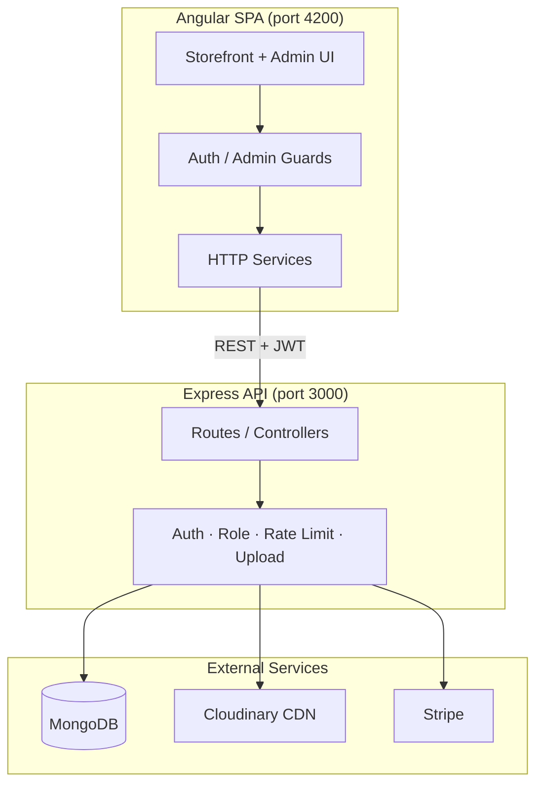
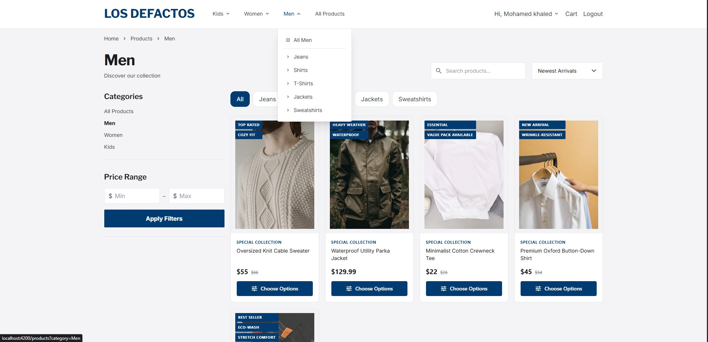
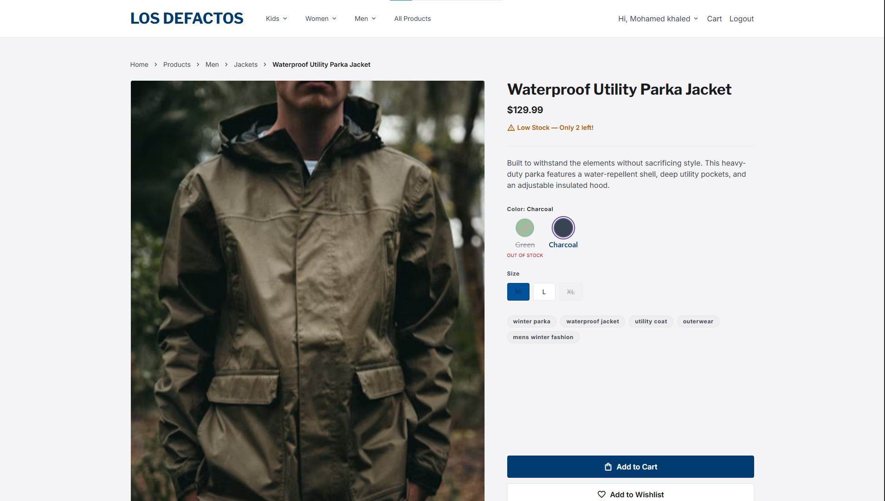
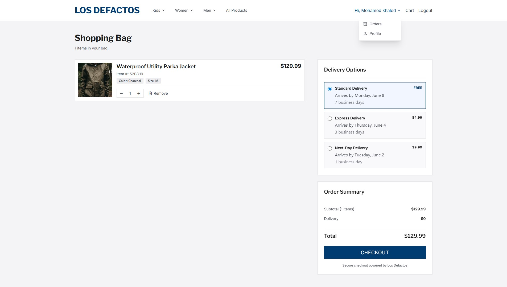
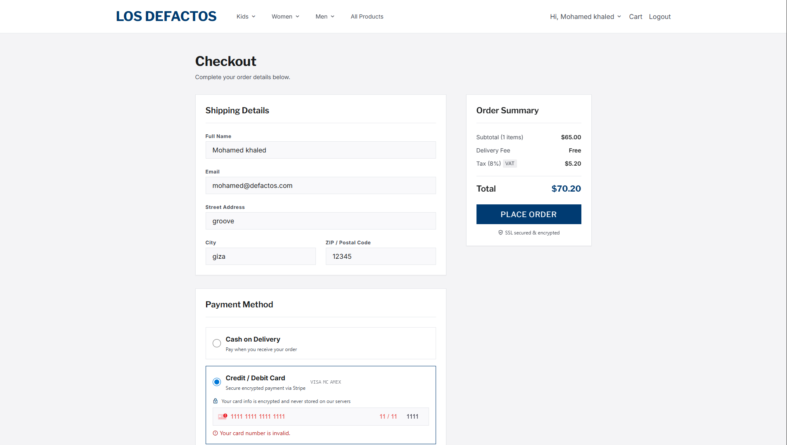
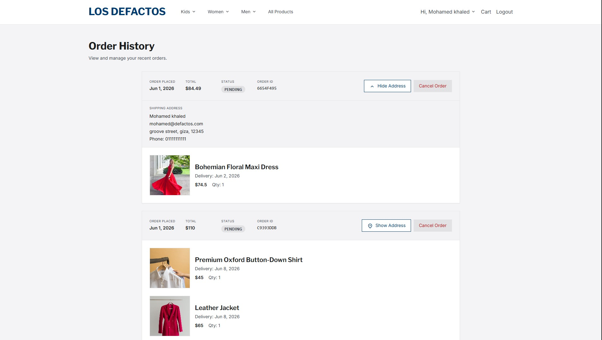
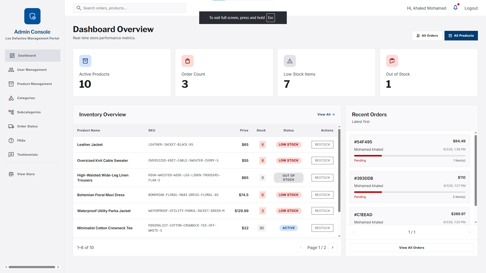
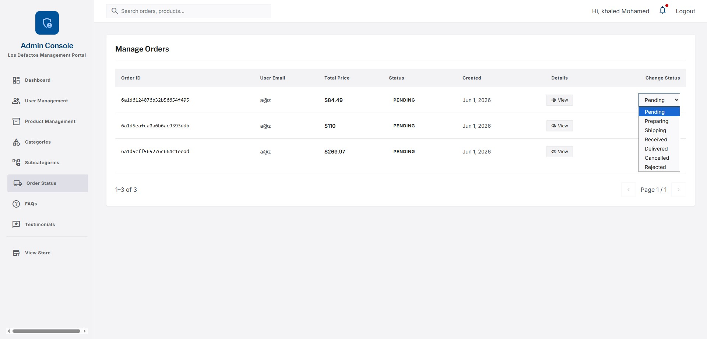
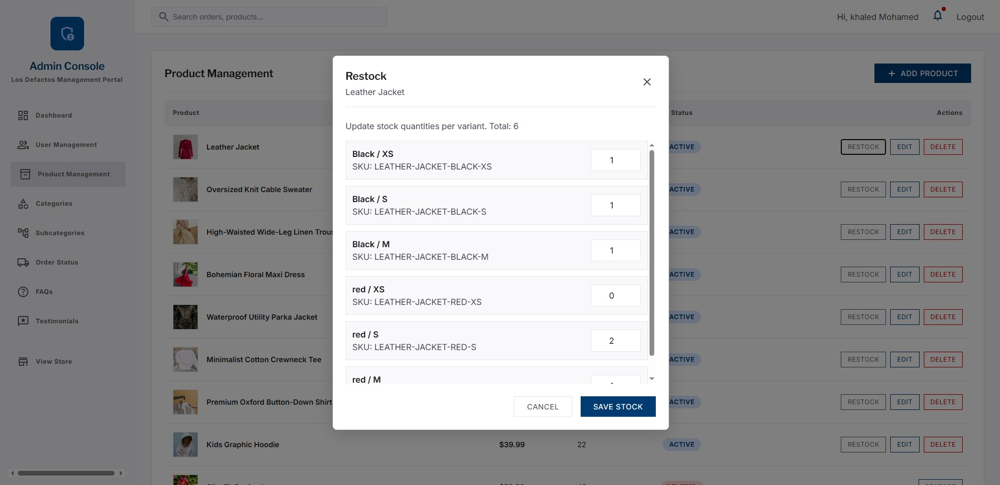
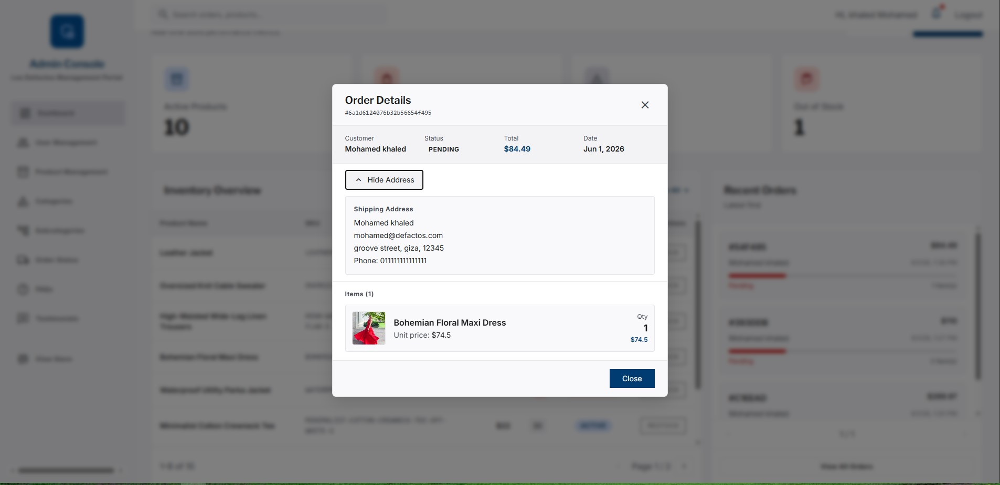

# Los Defactos — Full-Stack E-Commerce Platform

A production-style, full-stack online fashion store built as a **monorepo** with a modern **Angular** storefront and a **Node.js / Express** REST API backed by **MongoDB**. The application covers the complete retail lifecycle—from product discovery and variant-aware inventory to checkout, payments, order fulfillment, and a full **admin management portal**.

> **Note:** This project is designed for **local demonstration** and portfolio review. It is not currently deployed to a public environment; screenshots and this documentation are intended to communicate scope and engineering quality without a live URL.

---

## Table of Contents

- [Project Overview](#project-overview)
- [What This Project Demonstrates](#what-this-project-demonstrates)
- [Features](#features)
- [Tech Stack](#tech-stack)
- [System Architecture](#system-architecture)
- [Repository Structure](#repository-structure)
- [Key Functionalities](#key-functionalities)
- [Security & Data Integrity](#security--data-integrity)
- [Screenshots](#screenshots)
- [Local Setup](#local-setup)
- [Environment Variables](#environment-variables)
- [API Overview](#api-overview)
- [Future Improvements](#future-improvements)
- [License](#license)

---

## Project Overview

**Los Defactos** is a B2C e-commerce platform for apparel and accessories. Customers browse a categorized catalog, configure products by **color and size**, manage a persistent cart, and complete checkout with **shipping details** and **Stripe** payment integration. Registered users track orders, update profiles (including saved shipping addresses), and submit testimonials.

Administrators operate a separate **dashboard** to manage users, products (with variant-level stock), categories, subcategories, FAQs, testimonials, and order status—using soft-delete patterns, pagination, and Cloudinary-backed media uploads.

The frontend follows a dedicated **design system** (documented in `frontend/DESIGN.md`) with Tailwind CSS tokens, responsive layouts, and accessible form validation.

---

## What This Project Demonstrates

| Area | Highlights |
|------|------------|
| **Full-stack ownership** | End-to-end features across UI, API, database, and third-party services |
| **Real-world patterns** | JWT auth, role-based access, soft deletes, pagination, file uploads, payment intents |
| **UX & commerce logic** | Variant matrices, cart sync, delivery options, tax calculation, checkout autofill |
| **Operational concerns** | Rate limiting, Helmet CSP, CORS, input sanitization, structured error handling |
| **Maintainability** | Standalone Angular components, shared validators, reusable admin UI primitives |

---

## Features

### Storefront (Customer)

- **Home** — New arrivals and promotional sections driven by the product API
- **Product catalog** — Filtering by category and subcategory, sorting, sidebar navigation
- **Product detail** — Slug-based URLs, color/size selection, variant stock awareness
- **Shopping cart** — Server-synced cart, delivery option selection, quantity updates
- **Checkout** — Authenticated flow with validated shipping form, profile autofill, Stripe PaymentIntent
- **Orders** — Paginated order history, status display, cancel where applicable, expandable shipping address
- **Profile** — Edit account details and default shipping address used at checkout
- **Authentication** — Register / login with JWT; route guards for protected pages
- **Content** — FAQs and testimonials surfaced on the storefront

### Admin Dashboard

- **Dashboard shell** — Protected by `adminGuard`; separate layout from the public store
- **Users** — List, search, and manage customer accounts
- **Products** — CRUD with image upload (Cloudinary), variant stock matrix, restock modal, soft delete / restore
- **Categories & subcategories** — Hierarchical catalog management with image support for categories
- **Orders** — View order details, update fulfillment status, inspect shipping snapshots
- **FAQ** — Create and publish / unpublish entries
- **Testimonials** — Moderate user-submitted content
- **Admin UX** — Modal workflows, toast notifications, pagination, consistent form validation and sanitization

---

## Tech Stack

| Layer | Technologies |
|-------|----------------|
| **Frontend** | Angular 20, TypeScript, RxJS, Reactive Forms, Tailwind CSS 3 |
| **Backend** | Node.js, Express 5, Mongoose 8 |
| **Database** | MongoDB |
| **Auth** | JSON Web Tokens (JWT), bcrypt password hashing |
| **Payments** | Stripe Payment Intents |
| **Media** | Cloudinary (Multer memory upload → CDN URLs) |
| **Security** | Helmet, express-rate-limit, CORS middleware |
| **Tooling** | Angular CLI, Nodemon, Winston (logging) |

---

## System Architecture

The application uses a **decoupled client–server** architecture: the Angular SPA communicates with the REST API over HTTP; the API persists data in MongoDB and integrates with Stripe and Cloudinary.



### Request flow (example: checkout)

1. User adds items to cart → `POST/PUT` cart endpoints persist line items and delivery choice.
2. User opens checkout → `authGuard` ensures a valid JWT.
3. Frontend requests `POST /payment/create-payment-intent` → server computes subtotal, delivery, and tax, returns Stripe `clientSecret`.
4. On successful payment, order is created with a **shipping snapshot** (`shippingName`, `email`, `phone`, `address[]`).
5. Cart is cleared; user views the order under **My Orders**.

---

## Repository Structure

```
LosDefactos/
├── frontend/                # Angular storefront + admin dashboard
│   ├── src/app/
│   │   ├── auth/            # Login, signup
│   │   ├── layout/          # Home, products, cart, checkout, orders, profile
│   │   ├── admin/           # Dashboard modules
│   │   └── core/            # Guards, services, validators, shared components
│   └── DESIGN.md            # Brand & design tokens
├── backend/                 # Express REST API
│   ├── controllers/
│   ├── models/
│   ├── routes/
│   ├── middlewares/
│   └── seeds/               # Product seed data & script
└── docs/screenshots/        # UI captures for portfolio / README
```

---

## Key Functionalities

### Authentication & authorization

- **Registration / login** with hashed passwords (`bcrypt`)
- **JWT** stored client-side; attached to API requests
- **`authGuard`** — protects checkout, orders, and profile
- **`adminGuard`** — restricts `/dashboard` to `role: admin`
- **Stricter rate limiting** on login to reduce brute-force risk

### Product catalog & inventory

- Products linked to **category** and **subcategory**
- **Variants** per color/size with individual SKU and stock
- Admin **variant stock matrix** and dedicated **restock** workflow
- **Soft delete** for products, categories, and subcategories (restore supported)
- **Slug-based** product URLs for SEO-friendly routing
- Optional **`npm run seed:products`** to populate sample catalog data

### Cart & orders

- Cart tied to authenticated user; syncs on login
- Delivery options with fees applied server-side
- Orders store line items, totals, status, and **immutable shipping snapshot** at checkout
- User orders support **pagination**; admin can update order status

### Payments

- Stripe **PaymentIntent** created from server-validated cart totals
- Tax and delivery aligned between frontend display and backend calculation

### Media management

- Admin uploads for product and category images
- Files validated (type, size), uploaded to **Cloudinary**, URL stored in MongoDB
- `imageUrl` pipe normalizes CDN URLs across storefront and admin

### Forms & validation

- Shared utilities in `form-validators.util.ts`: sanitization, custom validators (`phone`, `zip`, `noHtml`, password strength)
- Reactive forms on **register**, **checkout**, and **admin** modals with inline error display

---

## Security & Data Integrity

- **Helmet** with CSP allowing Cloudinary image sources
- **Global rate limiting** (100 requests / 15 min per IP) + **auth rate limiting** (10 / hour on login)
- **CORS** restricted to configured frontend origins
- **Role middleware** on admin routes
- **Input sanitization** on the client before API submission; server-side validation on models
- **Secrets** via environment variables (never committed—see `.gitignore`)

---

## Screenshots

The following captures were taken from a local run of the application. All images are stored in [`docs/screenshots/`](docs/screenshots/).

### Storefront

| Home (LD1, LD2) |
|:--------------:|
|  ·  |

| Products Category & Product Details (LD2.1, LD2.2) |
|:-------------------------------------------------:|
|  ·  |

| Cart (LD3.1) | Checkout (LD3.2) |
|:-----------:|:---------------:|
|  |  |

| Orders (LD3.3) |
|:--------------:|
|  |

### Admin dashboard

| Dashboard overview (LDD1) | Product management (LDD4) |
|:------------------------:|:-------------------------:|
|  |  |

| Restock (LProd) · Order Detail (Ldetails) |
|:------------------------------------------:|
|  ·  |

---

## Local Setup

### Prerequisites

- **Node.js** 18+ (20 LTS recommended)
- **npm**
- **MongoDB** (local instance or [MongoDB Atlas](https://www.mongodb.com/cloud/atlas) connection string)
- **Stripe** test keys (for checkout)
- **Cloudinary** account (for admin image uploads)

### 1. Clone the repository

```bash
git clone https://github.com/NotMohamedKhaled/Los-Defactos
cd LosDefactos
```

### 2. Backend setup

```bash
cd backend
npm install
```

Create a `.env` file (use `envExample.txt` and `.env.example` as references):

```bash
# Windows PowerShell
copy envExample.txt .env
# Then edit .env with your real values
```

Start the API:

```bash
npm start
```

The server listens on **`http://localhost:3000`** (default).

**Optional — seed sample products** (requires categories/subcategories in DB or seed dependencies as defined in the seed script):

```bash
npm run seed:products
```

### 3. Frontend setup

Open a second terminal:

```bash
cd frontend
npm install
npm start
```

The Angular dev server runs at **`http://localhost:4200`**.

Update `frontend/src/environments/environment.ts` if your API port or Stripe publishable key differs:

```typescript
apiURL: 'http://localhost:3000/',
stripePublishableKey: 'pk_test_...',
```

### 4. Create an admin user

1. Register a new account via **`/signup`**.
2. In MongoDB, set that user's `role` field to **`admin`**:

```javascript
db.users.updateOne(
  { email: "you@example.com" },
  { $set: { role: "admin" } }
)
```

3. Log in again and navigate to **`/dashboard`**.

### 5. Verify the application

| URL | Purpose |
|-----|---------|
| `http://localhost:4200/home` | Storefront home |
| `http://localhost:4200/products` | Product listing |
| `http://localhost:4200/login` | Authentication |
| `http://localhost:4200/dashboard` | Admin portal (admin only) |

---

## Environment Variables

### Backend (`backend/.env`)

| Variable | Description |
|----------|-------------|
| `PORT` | API port (default `3000`) |
| `MONGO_URI` | MongoDB connection string |
| `JWT_SECRET` | Secret for signing JWTs |
| `JWT_EXPIRES_IN` | Token lifetime (e.g. `1d`) |
| `ALLOWED_ORIGINS` | Comma-separated CORS origins (include `http://localhost:4200`) |
| `CLOUDINARY_CLOUD_NAME` | Cloudinary cloud name |
| `CLOUDINARY_API_KEY` | Cloudinary API key |
| `CLOUDINARY_API_SECRET` | Cloudinary API secret |
| `CLOUDINARY_FOLDER` | Upload folder (e.g. `nti-commerce`) |
| `STRIPE_SECRET_KEY` | Stripe secret key (test mode) |

### Frontend (`frontend/src/environments/environment.ts`)

| Key | Description |
|-----|-------------|
| `apiURL` | Base URL for API requests |
| `stripePublishableKey` | Stripe publishable key for checkout |

---

## API Overview

Base URL: `http://localhost:3000`

| Prefix | Responsibility |
|--------|----------------|
| `POST /login` | Authenticate user, return JWT |
| `/user` | Profile, registration-related operations |
| `/product` | Public catalog + admin product CRUD |
| `/category` | Categories (public + admin) |
| `/subcategory` | Subcategories (public + admin) |
| `/cart` | User cart read/update |
| `/order` | User orders + admin order management |
| `/payment` | Stripe PaymentIntent creation |
| `/faq` | Public FAQs + admin management |
| `/testimonials` | Testimonials (public + admin) |

Protected routes expect an `Authorization: Bearer <token>` header. Admin routes additionally require `role: admin`.

---

<!-- ## Future Improvements

- **Deployment** — Dockerize services; deploy API (e.g. Render/Railway) and SPA (e.g. Vercel/Netlify) with CI/CD
- **Testing** — Unit tests (Jasmine/Karma), API integration tests (Jest/Supertest), E2E (Playwright/Cypress)
- **Observability** — Centralized logging, health checks, error monitoring (Sentry)
- **Search** — Full-text search (MongoDB Atlas Search or Elasticsearch)
- **Email** — Order confirmations and password reset via transactional email
- **Inventory alerts** — Low-stock notifications for admins
- **Internationalization** — Multi-currency and i18n
- **Performance** — API caching (Redis), image optimization pipelines, lazy-loaded admin chunks
- **Accessibility audit** — WCAG compliance pass on forms and navigation

--- -->

## License

This project is provided for **portfolio and educational purposes**. Contact the author for licensing if you intend to use it commercially.

---

**Built with Angular, Node.js, MongoDB, Stripe, and Cloudinary** — demonstrating full-stack e-commerce engineering from catalog to checkout to operations.
